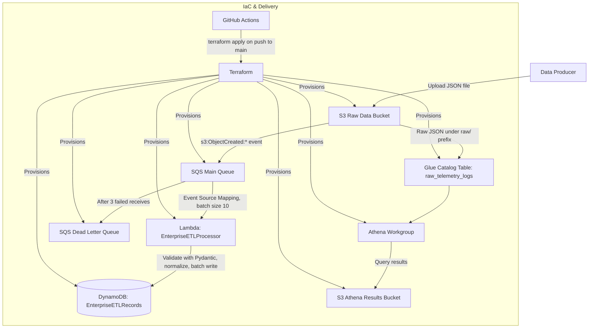

# Serverless Telemetry Ingestion Pipeline with Dual-Path Analytics

[](https://github.com/yashthakare-07/enterprise-etl-pipeline/actions/workflows/deploy.yml)


Serverless telemetry pipeline on AWS (S3 → SQS → Lambda → DynamoDB)
with an independent Athena/Glue path for ad hoc SQL analysis.
Provisioned via Terraform, deployed via GitHub Actions. Built to
learn event-driven architecture patterns — not a production system.

## Known Limitations

> This is a learning/portfolio project, not a hardened production deployment.
> It has not been load-tested and has not run against real production traffic.
> The gaps below are known, not overlooked — full detail and reasoning for
> each is in [Production Readiness Gaps](#production-readiness-gaps).
>
> - **State files (`terraform.tfstate`, `.tfstate.backup`) are currently committed to git**, despite a remote S3 backend being configured. This is inconsistent and is the top item to fix.
> - **No automated test suite.** The [Testing](#testing) section covers local lint/validate checks only — there is no `pytest`/`moto` coverage of the Lambda handler.
> - **The S3 event trigger and the Athena table are not prefix-aligned** (see [Project Architecture](#project-architecture)), so the processing path and the analytics path are not guaranteed to see identical objects.
> - **Encryption is not explicitly configured** for S3 or DynamoDB beyond AWS defaults, and CI/CD to AWS auth uses static IAM keys rather than OIDC.
> - **No monitoring/alerting** — no CloudWatch Alarms or SNS notifications on Lambda errors, DLQ depth, or failed deploys.

---

## Table of Contents

- [Known Limitations](#known-limitations)
- [Project Overview](#project-overview)
- [Features](#features)
- [Project Architecture](#project-architecture)
- [Folder Structure](#folder-structure)
- [Technology Stack](#technology-stack)
- [Prerequisites](#prerequisites)
- [Installation](#installation)
- [Configuration](#configuration)
- [Usage](#usage)
- [CI/CD Pipeline](#cicd-pipeline)
- [Infrastructure](#infrastructure)
- [Execution Flow](#execution-flow)
- [Testing](#testing)
- [Logs and Monitoring](#logs-and-monitoring)
- [Troubleshooting](#troubleshooting)
- [Security](#security)
- [Performance Considerations](#performance-considerations)
- [Production Readiness Gaps](#production-readiness-gaps)
- [Author](#author)

---

## Project Overview

This project is a serverless, event-driven pipeline for ingesting JSON
telemetry files on AWS. It was built to understand and demonstrate a
common but non-trivial pattern: decoupling ingestion from processing
using a queue, validating data at the boundary before it's trusted,
and exposing the same raw data through two independent paths — a
low-latency structured store for point lookups, and an ad hoc SQL
surface for analysis — without either path depending on the other.

Files land in an S3 bucket, which triggers an SQS-buffered Lambda that
validates each record against a strict schema and writes valid ones to
DynamoDB. Independently, the same raw files are queryable through
Athena via a Glue Catalog table, so the analytical path never waits on
the processing path.

This is a learning/portfolio project, scoped for low-to-moderate
volume, single-region use. It's best understood as a working
demonstration of the pattern rather than a hardened system — see
[Production Readiness Gaps](#production-readiness-gaps) for exactly
what's missing and why.

## Features

- Event-driven ingestion: S3 → SQS → Lambda, decoupling upload spikes from processing throughput
- Schema validation at the processing boundary using Pydantic, with invalid records dropped and logged rather than failing the whole batch
- Partial batch failure reporting (`ReportBatchItemFailures`) so only the SQS messages that actually failed are retried or dead-lettered
- Dead Letter Queue with a bounded retry count (`maxReceiveCount = 3`) for poison messages
- DynamoDB persistence on-demand billing (`PAY_PER_REQUEST`), no capacity planning required
- Ad hoc SQL analytics over raw ingested data via a Glue Catalog external table and a dedicated Athena workgroup with isolated query-result storage
- Infrastructure as Code with Terraform, using an S3 remote backend with native state locking (`use_lockfile`) so infrastructure is tracked consistently across local and CI runs
- CI/CD via GitHub Actions: `plan` runs on every pull request for review, `apply` runs only on pushes to `main`, against a previously saved plan file
- Least-privilege IAM: the Lambda execution role is scoped to only the specific S3 bucket, DynamoDB table, and SQS queue it needs
- Automatic global-uniqueness handling for S3/DynamoDB/Lambda/Glue/Athena resource names via a single generated suffix

## Project Architecture



The processing path (S3 → SQS → Lambda → DynamoDB) and the analytics path (S3 → Glue → Athena) are independent of each other; both read from the same S3 bucket, but the Athena table is scoped to a `raw/` key prefix while the S3 event notification that drives Lambda processing is **not** prefix-scoped, so the two paths are not guaranteed to see identical sets of objects. This is a known gap — tracked in [Production Readiness Gaps](#production-readiness-gaps).

## Folder Structure

```
enterprise-etl-pipeline/
├── .github/
│   └── workflows/
│       └── deploy.yml            # CI/CD workflow: terraform init/validate/plan/apply
├── terraform/
│   ├── .terraform/                # Provider plugin cache (generated)
│   ├── src/                       # Lambda function source, zipped by Terraform at apply time
│   │   ├── main.py                # Lambda handler (ETL logic)
│   │   ├── typing_extensions.py   # Vendored dependency
│   │   ├── pydantic/              # Vendored dependency (schema validation)
│   │   ├── pydantic_core/         # Vendored dependency
│   │   ├── annotated_types/       # Vendored dependency
│   │   ├── typing_inspection/     # Vendored dependency
│   │   └── *.dist-info/           # Vendored package metadata
│   ├── .terraform.lock.hcl        # Provider version lock file
│   ├── main.tf                    # Terraform/provider requirements, S3 backend, default tags
│   ├── storage.tf                 # S3 buckets, SQS queues, queue policy, bucket notification
│   ├── Compute.tf                 # IAM role/policy, Lambda function, SQS event source mapping
│   ├── dynamodb.tf                # DynamoDB table
│   ├── analytics.tf               # Glue Catalog database/table, Athena workgroup
│   ├── output.tf                  # Terraform outputs (bucket/table names)
│   ├── etl_processor.zip          # Lambda build artifact (regenerated on every apply)
│   ├── terraform.tfstate          # Known limitation: still committed despite remote backend — see Known Limitations
│   └── terraform.tfstate.backup   # Known limitation: still committed despite remote backend — see Known Limitations
├── sample_telemetry.json          # Example payload matching the expected schema
├── .gitignore
└── README.md
```

## Technology Stack

**Programming Languages:** Python 3.12

**Frameworks / Libraries:** Pydantic (schema validation), boto3 (AWS SDK)

**Cloud Services:** AWS Lambda, Amazon S3, Amazon SQS, Amazon DynamoDB, AWS Glue Data Catalog, Amazon Athena, Amazon CloudWatch Logs, AWS IAM

**Infrastructure as Code:** Terraform (`>= 1.0`, validated with `1.10.5`), providers `hashicorp/aws ~> 5.0`, `hashicorp/random`, `hashicorp/archive`

**CI/CD:** GitHub Actions (`hashicorp/setup-terraform@v3`, `aws-actions/configure-aws-credentials@v4`, `actions/checkout@v4`)

**Database:** Amazon DynamoDB (NoSQL, on-demand capacity)

**Storage:** Amazon S3 (raw data ingestion, Athena query results)

**Monitoring:** Amazon CloudWatch Logs

**Version Control:** Git / GitHub

**Development Tools:** AWS CLI, VS Code

## Prerequisites

- Python 3.12
- Terraform `>= 1.0` (repository validated against `1.10.5`)
- AWS CLI, configured with credentials that have permissions for S3, SQS, Lambda, DynamoDB, Glue, Athena, and IAM
- Git
- An AWS account with an S3 bucket pre-created for the Terraform remote state backend.
- A GitHub repository with `AWS_ACCESS_KEY_ID` and `AWS_SECRET_ACCESS_KEY` configured as Actions secrets, if using the CI/CD pipeline

## Installation

Clone the repository:

```bash
git clone https://github.com/yashthakare-07/enterprise-etl-pipeline.git
cd enterprise-etl-pipeline/terraform
```

Initialize Terraform against the remote backend:

```bash
terraform init
```

Validate the configuration:

```bash
terraform validate
```

Review the execution plan:

```bash
terraform plan -out=tfplan
```

Apply the plan:

```bash
terraform apply tfplan
```

Alternatively, push to the `main` branch to let the GitHub Actions workflow run `plan` and `apply` automatically.

## Configuration

**Terraform backend** (`main.tf`): requires a pre-existing S3 bucket for state storage. The bucket name currently referenced (`enterprise-etl-tfstate-unique-identifier`) is a placeholder and should be replaced with a globally unique bucket name of your own before first use.

**Lambda environment variables**, set automatically by Terraform:

| Variable | Description | Set By |
|---|---|---|
| `DYNAMODB_TABLE` | Name of the DynamoDB table the handler writes to | Terraform (`compute.tf`), from `aws_dynamodb_table.etl_table.name` |

**GitHub Actions secrets** required for the CI/CD workflow:

| Secret | Purpose |
|---|---|
| `AWS_ACCESS_KEY_ID` | AWS authentication for Terraform runs in CI |
| `AWS_SECRET_ACCESS_KEY` | AWS authentication for Terraform runs in CI |

> Do not commit AWS credentials, account IDs, or bucket names containing sensitive identifiers to the repository. Use GitHub Actions secrets and Terraform variables/placeholders instead.

## Usage

Upload a sample telemetry file to the raw data bucket to trigger the pipeline:

```bash
aws s3 cp sample_telemetry.json s3://<raw_data_bucket_name>/raw/sample_telemetry.json
```

Check the DynamoDB table for the resulting records:

```bash
aws dynamodb scan --table-name <dynamodb_table_name>
```

Query the raw data directly with Athena (from the AWS Console or CLI), using the workgroup provisioned by Terraform:

```sql
SELECT * FROM raw_telemetry_logs LIMIT 10;
```

Invoke the Lambda function directly for manual testing:

```bash
aws lambda invoke \
  --function-name <lambda_function_name> \
  --payload file://test-event.json \
  response.json
```

## CI/CD Pipeline

Defined in `.github/workflows/deploy.yml`, named **Enterprise ETL Terraform CI/CD**.

**Triggers:** `push` to `main`, and `pull_request` targeting `main`.

**Permissions:** `contents: read` only.

**Job:** a single job, `terraform`, running on `ubuntu-latest`.

**Steps:**
1. Checkout the repository (`actions/checkout@v4`)
2. Set up Terraform `1.10.5` (`hashicorp/setup-terraform@v3`)
3. Configure AWS credentials from repository secrets, region `us-east-1` (`aws-actions/configure-aws-credentials@v4`)
4. `terraform init` (working directory `./terraform`)
5. `terraform validate`
6. `terraform plan -out=tfplan`
7. `terraform apply -input=false tfplan` — **only** when the event is a `push` to `main`, so pull requests are planned but never applied

**Artifact generation:** the `tfplan` file is generated in the plan step and consumed directly by the apply step within the same job run; it is not currently uploaded as a persisted GitHub Actions artifact.

**Rollback and authentication:** there is no rollback or failure-notification step, and AWS authentication uses a static IAM user access key/secret pair rather than OIDC role assumption. Both are tracked in [Production Readiness Gaps](#production-readiness-gaps).

## Infrastructure

**Networking:** No VPC, subnets, or VPC endpoints are declared; the Lambda function runs outside a VPC and reaches S3, SQS, and DynamoDB over public AWS service endpoints.

**IAM:** One execution role (`etl_lambda_role`) for the Lambda function, with a single inline policy scoped to: `s3:GetObject`/`s3:ListBucket` on the raw data bucket; `dynamodb:PutItem`/`UpdateItem`/`GetItem`/`BatchWriteItem` on the DynamoDB table; `sqs:ReceiveMessage`/`DeleteMessage`/`GetQueueAttributes` on the main queue; and `logs:CreateLogGroup`/`CreateLogStream`/`PutLogEvents` for CloudWatch Logs.

**Lambda:** `EnterpriseETLProcessor_<suffix>`, Python 3.12 runtime, 256 MB memory, 60-second timeout, triggered by an SQS event source mapping with a batch size of 10 and `ReportBatchItemFailures` enabled.

**S3:** a raw data ingestion bucket and a separate Athena query-results bucket, both suffixed with a randomly generated identifier for global uniqueness.

**SQS:** a main processing queue (60-second visibility timeout, redrive to DLQ after 3 receives) and a dead letter queue (14-day retention).

**DynamoDB:** `EnterpriseETLRecords_<suffix>`, on-demand billing, partition key `record_id` (String), sort key `timestamp` (String), no secondary indexes.

**Glue / Athena:** a Glue Catalog database and an external table (`raw_telemetry_logs`) over the `raw/` prefix of the raw data bucket, queried through a dedicated Athena workgroup whose results are written to the Athena results bucket.

**EventBridge / SNS:** not used in this project.

## Execution Flow

1. A JSON telemetry file is uploaded to the S3 raw data bucket.
2. S3 emits an `s3:ObjectCreated:*` event, delivered as a message to the SQS main queue (permitted by an explicit queue policy granting S3 send access).
3. The SQS event source mapping delivers a batch of up to 10 messages to the Lambda function.
4. For each message, the Lambda handler parses the embedded S3 event, downloads the referenced object, and parses its JSON content.
5. Each record is validated against the `TelemetryRecord` Pydantic schema; invalid records are dropped and logged, valid records have their `status` field normalized to uppercase.
6. Valid records are converted to DynamoDB-compatible types (`Decimal` instead of `float`) and written using the batch writer.
7. Any message that fails processing is reported back to Lambda via `batchItemFailures`, so only that message is retried (up to 3 times) before landing in the dead letter queue.
8. Independently of steps 3–7, the same raw JSON files under the `raw/` prefix are queryable through Athena via the Glue Catalog table, without waiting for Lambda processing.

Note: SQS provides at-least-once delivery, so a message can in principle be delivered more than once. Behavior of this pipeline under duplicate delivery has not been explicitly tested or documented — see [Production Readiness Gaps](#production-readiness-gaps).

## Testing

**No automated test suite exists yet.** The checks below are local lint/validation checks run before committing, not unit or integration tests, and they do not exercise the Lambda handler's actual logic against mocked AWS services.

```bash
python -m py_compile terraform/src/main.py   # Syntax check of the Lambda handler
terraform fmt main.tf                         # Formatting normalization
terraform init -backend=false                 # Local provider init without touching remote state
terraform validate                            # Configuration consistency check
```

Expected output for `terraform validate`:

```
Success! The configuration is valid.
```

End-to-end verification (uploading `sample_telemetry.json` and confirming a corresponding DynamoDB item) has been done manually during development but is not currently captured as evidence (logs/screenshots) in this repository.

## Logs and Monitoring

**CloudWatch Logs:** each Lambda function version writes to its own log group under `/aws/lambda/<function-name>`. The currently deployed function's log group has no explicit retention policy configured, meaning logs are retained indefinitely by default.

**GitHub Actions logs:** each workflow run's `init`, `validate`, `plan`, and `apply` output is available under the Actions tab for the repository, per run.

**Alerts / Metrics:** none configured. No CloudWatch Alarms, SNS notifications, or custom metrics currently exist — see [Production Readiness Gaps](#production-readiness-gaps).

## Troubleshooting

| Issue | Cause | Solution |
|---|---|---|
| Duplicate S3 buckets / DynamoDB tables appearing across multiple applies | No remote Terraform backend configured; each run started from empty local state and generated a new random resource-name suffix, leaving prior resources untracked and orphaned | Configure the S3 remote backend with state locking in `main.tf` (implemented) so all runs share the same state |
| `terraform apply` fails validating the S3 bucket notification configuration | S3 requires the target SQS queue to have a resource policy explicitly permitting `s3.amazonaws.com` to send messages before the notification can be created | Add an explicit `depends_on` from the bucket notification resource to the SQS queue policy resource (implemented in `storage.tf`) |
| CI job runs `terraform` commands against the wrong directory | GitHub Actions runner's default working directory did not match the repository's `terraform/` subfolder | Set `working-directory: ./terraform` on each Terraform step in `deploy.yml` (implemented) |
| Lambda import errors for `pydantic` at runtime | AWS Lambda's Python 3.12 managed runtime does not include third-party packages | Vendor the dependency (and its transitive dependencies) directly into `terraform/src`, which is zipped into the deployment package by the `archive_file` data source |

> Note: the remote backend fix above (row 1) addressed *new* state going forward, but the local state files generated before that fix are still tracked in git — see [Known Limitations](#known-limitations).

## Security

- **IAM:** the Lambda execution role uses a single inline policy scoped to the specific S3 bucket, DynamoDB table, and SQS queue the function interacts with, rather than a broad managed policy.
- **Secrets management:** AWS credentials for CI/CD are stored as GitHub Actions repository secrets and are never written into the codebase.
- **Authentication (CI to AWS):** currently uses a static IAM user access key/secret pair, not OIDC-based role assumption — see [Production Readiness Gaps](#production-readiness-gaps).
- **Encryption:** S3 server-side encryption, S3 bucket versioning, and DynamoDB encryption are not explicitly configured beyond AWS defaults — see [Production Readiness Gaps](#production-readiness-gaps).
- **Data validation:** all inbound records are validated against a strict schema before being persisted, reducing the risk of malformed or unexpected data reaching DynamoDB.

## Performance Considerations

- **Cold starts:** the Lambda function is configured with 256 MB of memory and a 60-second timeout; no provisioned concurrency is configured, so cold starts are possible under infrequent invocation patterns.
- **Batching:** the SQS event source mapping uses a batch size of 10, balancing per-invocation overhead against processing latency.
- **Scalability:** DynamoDB uses on-demand (`PAY_PER_REQUEST`) billing, which scales automatically with load without capacity planning; SQS absorbs upload bursts so Lambda concurrency scales independently of ingestion rate.
- **Cost optimization:** on-demand DynamoDB and serverless Lambda avoid idle-capacity cost, but orphaned S3 buckets and DynamoDB tables from earlier, state-less deployments (see Troubleshooting) represent unnecessary ongoing cost until manually cleaned up.
- **Terraform efficiency:** a single shared S3 backend with native locking avoids redundant resource creation across concurrent or repeated CI runs.

## Production Readiness Gaps

This project is a working demonstration of an event-driven pipeline pattern, not a production-hardened system. These are the concrete gaps between what exists today and what production use would require, roughly ordered by priority:

1. **Remove committed state files** — `terraform.tfstate`, `terraform.tfstate.backup`, and the built `etl_processor.zip` are currently tracked in git even though a remote S3 backend is configured. This is an inconsistency and the highest-priority cleanup.
2. **Align the S3 trigger and Athena scope** — scope the S3 event notification to the `raw/` prefix so the Lambda-processing path and the Athena-queried path are guaranteed to see the same set of objects.
3. **Add an automated test suite** — no unit or integration tests exist for `main.py`; `pytest` with `moto` (mocked AWS services) would cover schema validation, batch-write behavior, and partial-failure handling.
4. **Verify idempotency under duplicate SQS delivery** — SQS provides at-least-once delivery by design; current behavior under redelivery is undocumented and untested.
5. **Explicitly configure encryption** — S3 server-side encryption and versioning, and DynamoDB encryption at rest, are not explicitly set beyond AWS defaults.
6. **Migrate to OIDC-based CI authentication** — replace the static IAM user access key/secret pair with GitHub Actions OIDC role assumption.
7. **Add monitoring and alerting** — CloudWatch Alarms and SNS notifications for Lambda errors, DLQ depth, and failed CI/CD runs.
8. **Add a rollback / failure-notification step** to the CI/CD workflow.
9. **Move vendored dependencies into a Lambda Layer** instead of bundling `pydantic` and related packages directly with the function source.
10. **Parameterize Terraform** with input variables (region, environment, naming) instead of hardcoded values.
11. **Persist the Terraform plan as a GitHub Actions artifact** for auditability between the plan and apply steps.
12. **Multi-region deployment support.**

## Author

**Name:** Yash Thakare

**Designation:** Student

**GitHub:** [@yashthakare-07](https://github.com/yashthakare-07)

**LinkedIn:** https://www.linkedin.com/in/yashthakare1711
